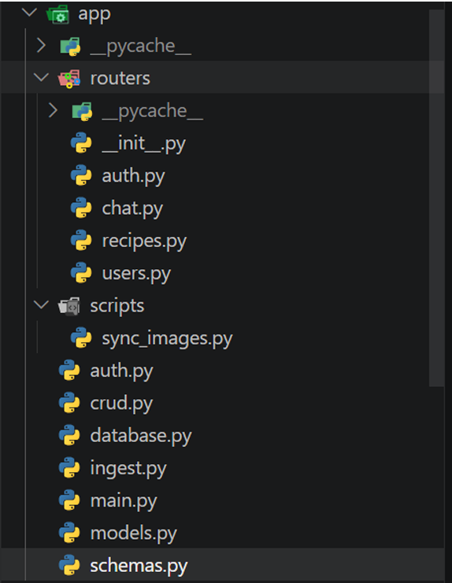
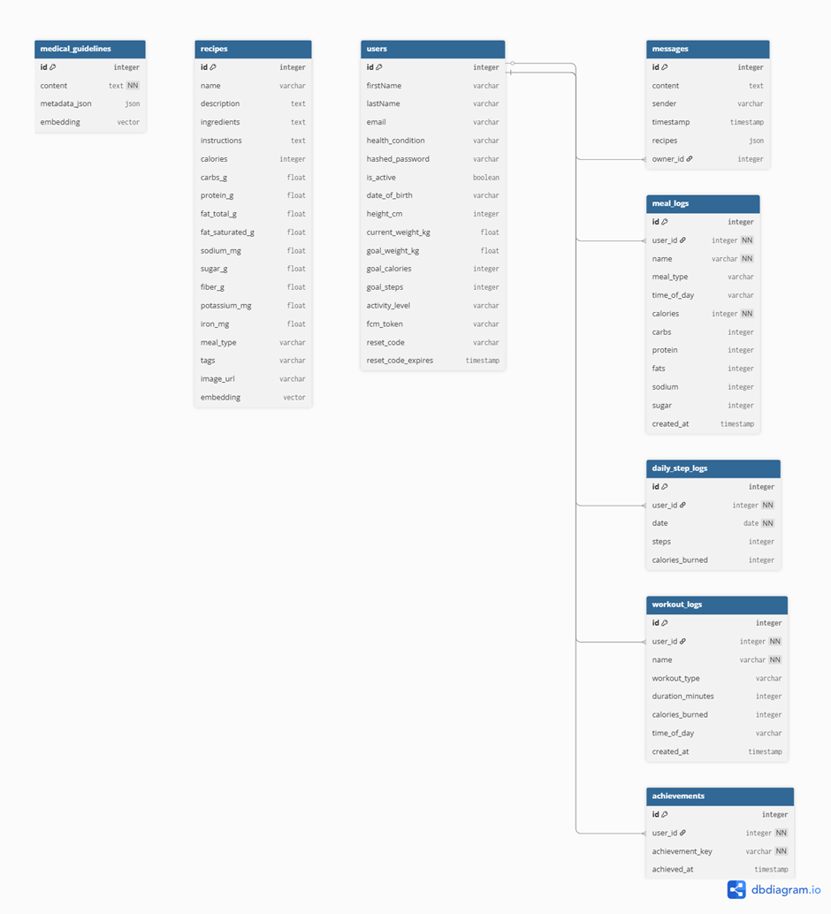

# Aduane Intelligence — Backend API

## Table of Contents

- [Project Overview](#project-overview)
- [Tech Stack](#tech-stack)
- [Prerequisites](#prerequisites)
- [Getting Started](#getting-started)
  - [Installation](#installation)
  - [Environment Variables](#environment-variables)
  - [Database Setup](#database-setup)
  - [Running Locally](#running-locally)
  - [Running in Production Mode](#running-in-production-mode)
  - [Running Tests](#running-tests)
- [API Reference](#api-reference)
- [Project Structure](#project-structure)
- [Database Schema](#database-schema)
- [Deployment](#deployment)
  - [Cloud Deployment](#cloud-deployment)
- [Security](#security)
- [Troubleshooting](#troubleshooting)

---

## Project Overview

This backend service powers Aduane Intelligence, a Ghana Recipe AI application designed to provide culturally relevant meal recommendations. It intelligently filters recipes based on specific user health conditions — namely Diabetes, Hypertension, and Cholesterol — by running inputs through trained `DecisionTreeClassifier` machine learning models.

The architecture is built as a REST API microservice using FastAPI. It utilises a hybrid database approach: relational data is managed via PostgreSQL (hosted on Supabase), and high-dimensional vector embeddings for medical guidelines are stored and queried using ChromaDB and pgvector for Retrieval-Augmented Generation (RAG).

> **Vector Storage Note:** ChromaDB is used for local development and testing of vector search.
> In production, pgvector (via Supabase) is the primary vector store. Both are seeded by
> running `migrate_to_supabase.py`.

- **Frontend Repository:** https://github.com/alappiah/Aduane_Intelligence.git

---

## Tech Stack

| Layer                 | Technology                                                                            |
| --------------------- | ------------------------------------------------------------------------------------- |
| Runtime / Language    | Python 3.10.0                                                                         |
| Web Framework         | FastAPI 0.128.4                                                                       |
| ASGI Server           | Uvicorn 0.40.0                                                                        |
| Relational Database   | PostgreSQL 15                                                                         |
| ORM                   | SQLAlchemy 2.0.46                                                                     |
| Vector Extension      | pgvector 0.4.2                                                                        |
| Vector Database       | ChromaDB 1.4.1                                                                        |
| Authentication        | JWT via passlib 1.7.4, python-jose 3.5.0, bcrypt 5.0.0                                |
| AI & Machine Learning | scikit-learn 1.6.1, sentence-transformers 5.2.2, Local Ollama Integration, Groq 1.1.2 |
| File Storage          | Cloudinary 1.44.1                                                                     |
| Push Notifications    | Firebase Admin SDK 6.5.0                                                              |
| Containerisation      | Docker, Docker Compose                                                                |
| Package Manager       | pip                                                                                   |

---

## Prerequisites

- **Runtime:** Python 3.10.0
- **Database:** PostgreSQL 15 (if running the database locally)
- **Other:** Docker and Docker Compose (optional, for local containerised database)
- **AI Engine:** Local Ollama server running (if utilising local LLM fallback) Install from [ollama.com](https://ollama.com), then pull the required model:

```bash
  ollama pull llama3.1:8b
  ollama serve
```

> If using Groq instead, this step can be skipped — just ensure `GROQ_API_KEY` is set in your `.env`

### Firebase Setup

1. Go to [Firebase Console](https://console.firebase.google.com/) and create a project named `aduane-intelligence`
2. Enable **Cloud Messaging** for push notifications
3. Go to Project Settings → Service Accounts → Generate new private key
4. Rename the downloaded file to `firebase-service-account.json` and place it in the root directory

---

## Getting Started

### Installation

Clone the repository and install the required dependencies:

```bash
# Clone the repository
git clone https://github.com/your-org/aduane-intelligence-backend.git
cd aduane-intelligence-backend

# Create and activate a virtual environment
python3.10 -m venv venv
source venv/bin/activate  # On Windows use: venv\Scripts\activate

# Install dependencies
pip install -r requirements.txt
```

### Environment Variables

Create a `.env` file in the root directory. You can copy the provided `.env.example` if available.

| Variable Name           | Description                             | Example Value              | Required |
| ----------------------- | --------------------------------------- | -------------------------- | -------- |
| `EMAIL_SENDER`          | Sender email address for system alerts  | `example@gmail.com`        | Yes      |
| `EMAIL_PASSWORD`        | App password for the sender email       | `your_app_password`        | Yes      |
| `CLOUDINARY_CLOUD_NAME` | Cloudinary cloud namespace              | `your_cloud_name`          | Yes      |
| `CLOUDINARY_API_KEY`    | Cloudinary API Key                      | `your_api_key`             | Yes      |
| `CLOUDINARY_API_SECRET` | Cloudinary API Secret                   | `your_api_secret`          | Yes      |
| `DATABASE_URL`          | PostgreSQL connection string (Supabase) | `postgresql://postgres...` | Yes      |
| `GROQ_API_KEY`          | API key for Groq inference engine       | `gsk_...`                  | Yes      |

> **Note:** You also need a valid `firebase-service-account.json` file in the root directory for push notifications to function.

### Database Setup

**Create the Local Database (Docker):**

```bash
docker-compose up -d db
```

This spins up a `postgres:15` container mapped to port `5432`.

**Run Migrations:**

Execute the migration SQL script against your database to set up tables and vector extensions:

```bash
psql -d $DATABASE_URL -f supabase_migration.sql
```

**Seed Vector Data:**

Ingest medical guidelines and disease parameters into the Supabase database using SentenceTransformers (`all-MiniLM-L6-v2`):

```bash
python migrate_to_supabase.py
```

### Running Locally

To start the FastAPI development server with hot-reload enabled:

```bash
uvicorn main:app --reload --host 0.0.0.0 --port 8000
```

The API will be available at `http://localhost:8000`. Swagger documentation will be available at `http://localhost:8000/docs`.

### Running in Production Mode

For production environments, utilise multiple Uvicorn workers or run via Gunicorn:

```bash
uvicorn main:app --host 0.0.0.0 --port 8000 --workers 4
```

### Running Tests

To verify database connections and push notification integrations:

```bash
# Test Supabase DB connection
python test_db.py

# Test Firebase push notifications
python test_push.py

```

---

## API Reference

- **Base URL (Local):** `http://localhost:8000`
- **Base URL (Production):** `https://aduane-intelligence-backend.onrender.com`
- **Authentication:** Standard JWT implementation. Include the token in the `Authorization` header as `Bearer <token>`.

| Method & Path     | Description                        | Request Body                                                              | Response Format       | Auth Required |
| ----------------- | ---------------------------------- | ------------------------------------------------------------------------- | --------------------- | ------------- |
| `POST /recommend` | Fetches personalised Ghana recipes | `{"query": string, "health_condition": string, "current_reading": float}` | JSON array of recipes | Yes           |

---

## Project Structure



---

## Database Schema

The database operates on PostgreSQL with pgvector for semantic search and SQLite via ChromaDB for local vector tracking.



---

## Deployment

### Cloud Deployment

This API is designed to integrate seamlessly with Supabase for database hosting. The application runtime can be deployed to platforms like Render.

**Deployment Steps (e.g., Render):**

1. Connect your GitHub repository to Render.
2. Select "Web Service" and set the runtime environment to Python 3.10.
3. Build Command: `pip install -r requirements.txt`
4. Start Command: `uvicorn main:app --host 0.0.0.0 --port $PORT`
5. Map all values from your local `.env` into the environment variables settings on your hosting provider.

---

## Security

- **Authentication**: Endpoints are protected via JSON Web Tokens (JWT) using `python-jose` and `bcrypt` for password hashing.
- **Service Accounts**: Firebase Admin SDK is authenticated strictly via a private JSON key file (`firebase-service-account.json`) which is excluded from version control via `.gitignore`.
- **CORS Configuration**: Configure allowed origins in `main.py` to accept requests only from the verified frontend domains.
- **Input Validation**: Incoming request bodies (like `RecipeRequest`) are strictly validated using Pydantic models.

---

## Troubleshooting

**Missing Machine Learning Models**

> Error: `Critical: ML Models missing`
> Solution: Ensure `diabetes_model.pkl`, `hypertension_model.pkl`, `cholesterol_model.pkl`, and `encoder.pkl` exist in the `/ml_models` or `/models` directory.

**Supabase Database Connection Fails**

> Error: Exception thrown in `test_db.py`
> Solution: Check your `.env` file to ensure `DATABASE_URL` is correctly formatted and Supabase network access is not IP-restricted.

**Local Ollama Instance Unreachable**

> Error: `ollama chat Exception`
> Solution: If using the local Ollama fallback instead of Groq, verify that the Ollama service is running (`ollama serve`) and the required models (e.g., `phi3:mini`) are pulled.

**Push Notifications Not Sending**

> Error: `Invalid credential or missing default app initialization`
> Solution: Verify that `firebase-service-account.json` exists in the root directory and contains the valid `private_key` and `project_id` (`"aduane-intelligence"`).

**pgvector Extension Missing**

> Error: Tables fail to create during `migrate_to_supabase.py`
> Solution: Ensure your database user has superuser privileges to execute `CREATE EXTENSION IF NOT EXISTS vector;` before adding `MedicalGuideline` rows.

---
